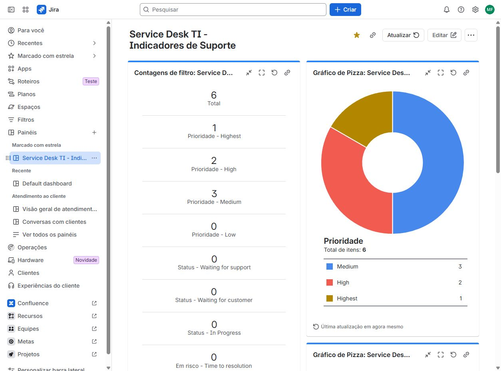
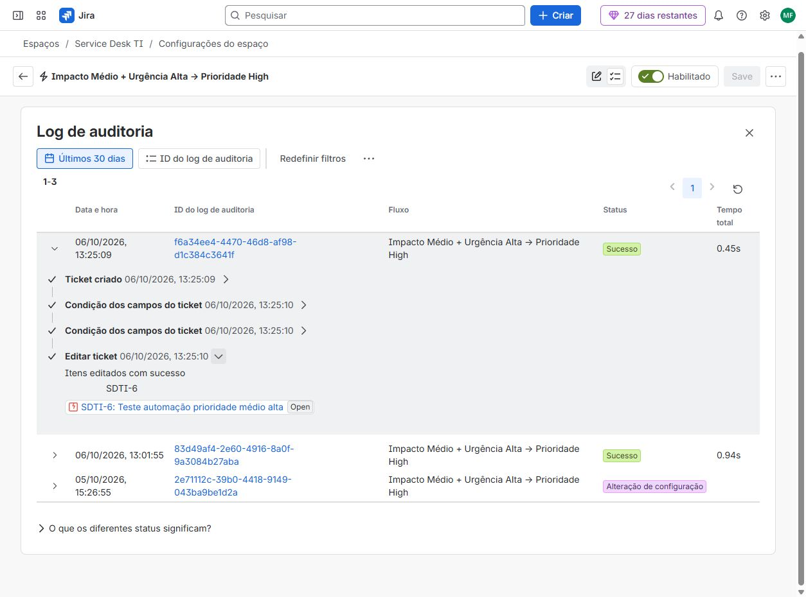
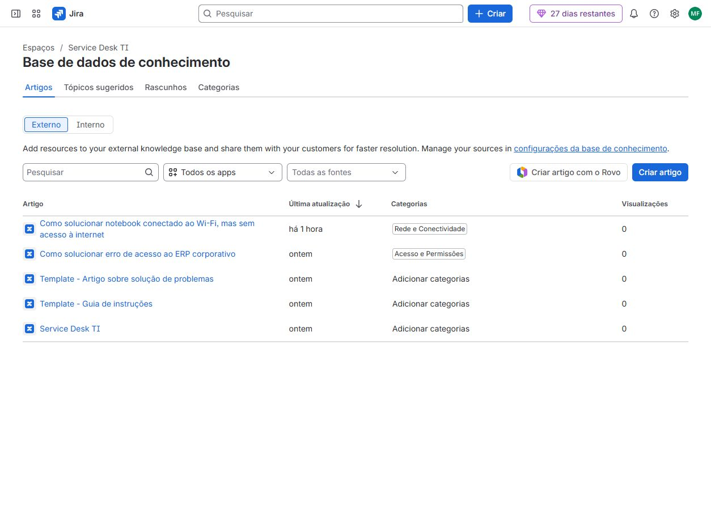

# Laboratório de Service Desk com Jira Service Management

Simulação de uma operação de suporte de TI com abertura, triagem, priorização, investigação e resolução de chamados no Jira Service Management.

O projeto explora a organização do atendimento por filas, responsáveis, automações e acordos de nível de serviço (SLA). A documentação de soluções foi trabalhada no Confluence, e os indicadores operacionais foram organizados em um dashboard no Jira.

## Objetivo

Praticar o fluxo de atendimento de um Service Desk e documentar as configurações e procedimentos utilizados em incidentes simulados.

## Ferramentas

- Jira Service Management: chamados, filas, prioridades, responsáveis, automações e SLA.
- Confluence: documentação e base de conhecimento.

## Escopo do laboratório

- Tipos de solicitação para organizar a entrada de chamados.
- Classificação por impacto, urgência e prioridade.
- Filas para acompanhar e organizar o atendimento.
- Atribuição de responsáveis.
- Testes de automação de prioridade.
- SLA de primeira resposta e de resolução.
- Investigação e registro de soluções para incidentes simulados.
- Dashboard operacional com distribuição por prioridade, status e responsável, além de chamados criados e resolvidos.

## Cenários trabalhados

| Cenário | Prática demonstrada |
|---|---|
| Usuário sem acesso ao ERP | Investigação de autenticação e permissões |
| Notebook conectado ao Wi-Fi, sem acesso à internet | Investigação de conectividade |
| Falha de acesso ao Power BI | Registro e triagem de incidente |
| Chamados de teste de prioridade | Validação de regras de automação |

O Power BI aparece como sistema afetado em um chamado. Não foi utilizado como ferramenta de análise neste projeto.

## Exemplo de atendimento: acesso ao ERP

No chamado SDTI-2, o usuário simulado relatou a mensagem “Acesso negado” ao tentar acessar o ERP, embora outros serviços estivessem funcionando.

O registro da investigação incluiu validações de gateway, conectividade IPv4, resolução DNS e HTTPS. No cenário do laboratório, a análise identificou uma conta ativa sem o perfil ou grupo de acesso necessário ao ERP. O chamado foi concluído com o atendimento registrado no histórico.

Esse exemplo demonstra o uso de testes para isolar a falha e direcionar a investigação para autenticação e autorização. Os procedimentos e resultados representam uma simulação.

## Resultado registrado

Na exportação analisada, o projeto Service Desk TI (SDTI) apresentava:

| Indicador | Quantidade |
|---|---:|
| Total de chamados | 6 |
| Chamados abertos | 4 |
| Chamados concluídos | 2 |
| Chamados abertos sem responsável | 3 |
| Prioridade Medium | 3 |
| Prioridade High | 2 |
| Prioridade Highest | 1 |

Esses números representam o estado da exportação, e não indicadores atualizados continuamente.

## Testes e interpretação de SLA

Parte dos chamados foi criada para testar configurações, sem executar um atendimento completo. O SDTI-6, por exemplo, foi utilizado para testar a automação de prioridade.

A exportação apresentou saldos negativos de SLA de primeira resposta nos quatro chamados abertos. Esses registros fazem parte da avaliação do laboratório; não representam uma operação real de atendimento. A captura do SDTI-6 mostra o prazo de primeira resposta vencido e o prazo de resolução exibido no Jira.

## Evidências

[Veja a galeria completa com 20 capturas do laboratório](docs/images/README.md): dashboard, filas, atendimento do ERP, formulário de triagem, SLA, automações e base de conhecimento.

### Dashboard operacional

### Automação de prioridade

O registro de auditoria confirma a execução bem-sucedida da regra no SDTI-6. Esse chamado foi criado apenas para teste.

### Base de conhecimento

As capturas foram realizadas em 7 de outubro de 2026. Os objetivos de SLA variam conforme a categoria da solicitação; as metas de Incidents mostradas na galeria não se aplicam automaticamente a todos os chamados.

## Aprendizados

- Organizar chamados por tipo de solicitação, prioridade e responsável.
- Utilizar impacto e urgência na triagem.
- Configurar e testar automações de atendimento.
- Acompanhar os prazos de primeira resposta e resolução.
- Registrar hipóteses, testes e resultados da investigação técnica.
- Documentar soluções para consulta posterior.
- Interpretar indicadores operacionais considerando o contexto dos testes.

## Natureza do projeto

Este é um laboratório educacional com chamados simulados. Não representa experiência de atendimento a clientes reais nem uma implantação em produção.
